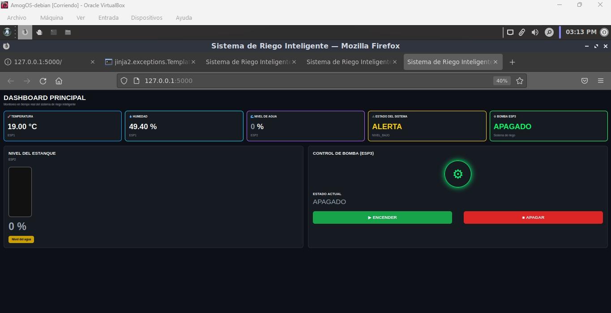
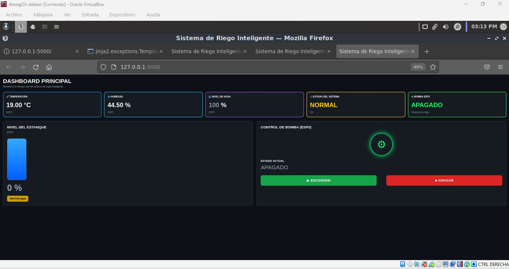
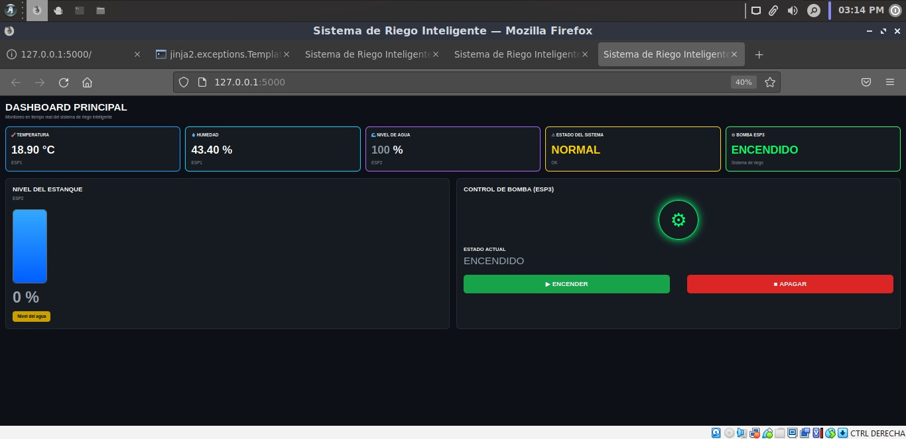
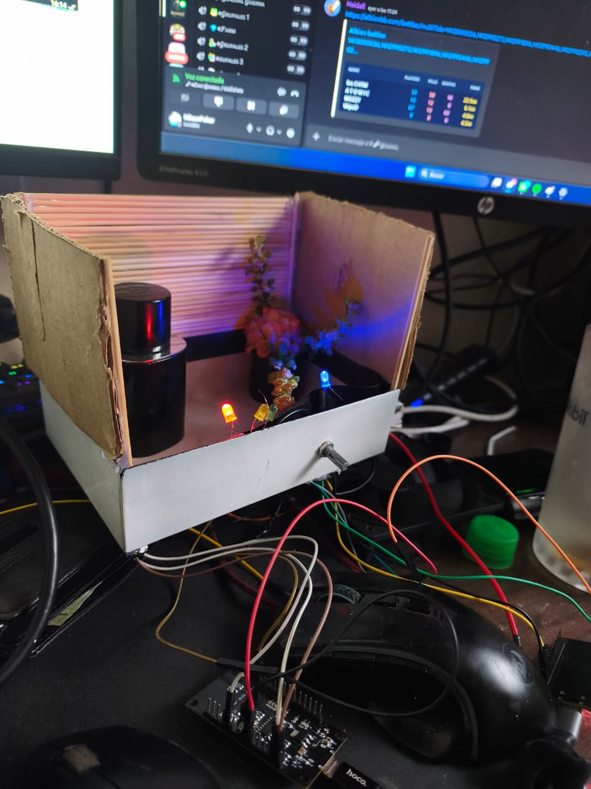
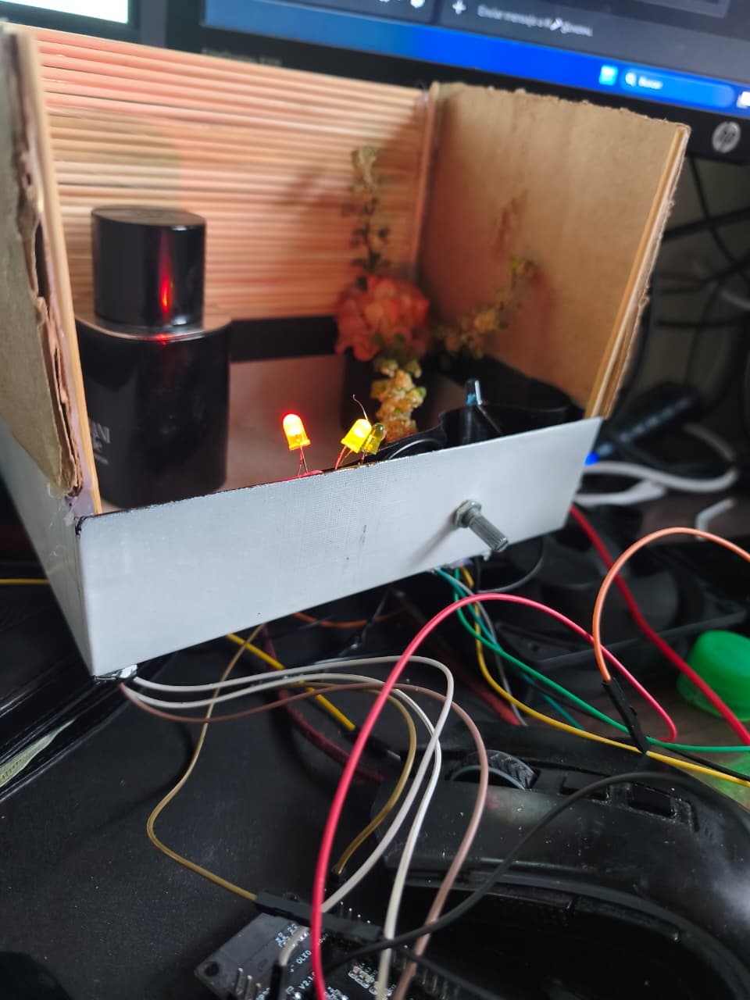
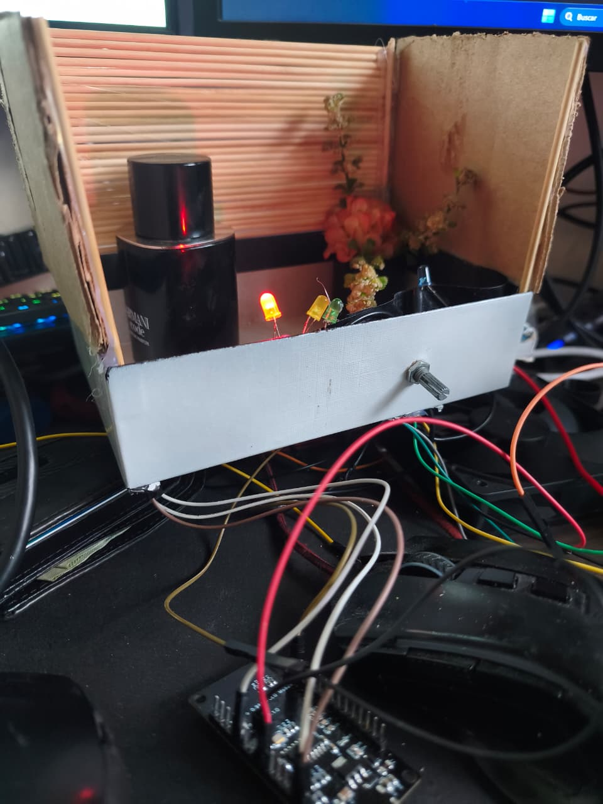

# 🌱 Sistema de Riego Inteligente IoT (MataPlantas4000)

## 📖 Descripción

Proyecto desarrollado para la asignatura de **Sistemas Operativos Embebidos**, utilizando comunicación inalámbrica **ESP-NOW**, una aplicación web desarrollada con **Flask** y una base de datos **SQLite**.

El objetivo del proyecto es simular un sistema de riego inteligente capaz de monitorear en tiempo real la temperatura, humedad y nivel del estanque, permitiendo además controlar una bomba de agua desde una interfaz web y registrar automáticamente todos los eventos importantes del sistema.

---

# 👨‍💻 Integrantes

- Nilson Ayala
- Melissa Rojas
- Hugo Cornejo

---

# 👨‍🏫 Profesor

**José Fernando Poblete Cabezas**  
*(El único más fuerte que Batman 🦹🏻‍♂️)*

---

# ⚙ Tecnologías Utilizadas

- ESP32
- ESP8266
- ESP-NOW
- Python
- Flask
- SQLite
- HTML5
- CSS3
- JavaScript
- Git
- GitHub

---

# 🛠 Arquitectura del Sistema

```
              ESP1
     (Temperatura y Humedad)
               │
               │ ESP-NOW
               ▼
          ESP3 CENTRAL
      (Servidor Flask + SQLite)
               ▲
               │ ESP-NOW
               │
            ESP2
      (Nivel del Estanque)
               │
               ▼
        Página Web en Tiempo Real
```

---

# 📷 Dashboard del Sistema

## Estado Normal



---

## Bomba Encendida



---

## Alerta por Nivel Bajo



---

# 📸 Prototipo Físico

## Vista General



---

## Funcionamiento del Sistema



---

## Activación de la Bomba



---

# ESP1 - Sensor Ambiental

### Funciones

- Lectura de temperatura.
- Lectura de humedad.
- Envío de datos mediante ESP-NOW.
- Activación del LED rojo cuando existe una condición de alerta.
- LED verde cuando el sistema funciona normalmente.

---

# ESP2 - Nivel del Estanque

### Funciones

- Simulación del nivel de agua mediante un potenciómetro.
- Envío del porcentaje del estanque al ESP3.
- Activación de alerta cuando el nivel es bajo.

---

# ESP3 - Servidor Central

### Funciones

- Recepción de información mediante ESP-NOW.
- Comunicación con la aplicación Flask.
- Control de la bomba desde la interfaz web.
- Actualización automática de los datos.
- Registro de eventos en SQLite.

---

# 🌐 Página Web

La aplicación web desarrollada permite visualizar en tiempo real:

- 🌡 Temperatura.
- 💧 Humedad.
- 🌊 Nivel del estanque.
- ⚠ Estado del sistema.
- 🚨 Alertas.
- 🔵 Estado de la bomba.
- ▶ Encendido de la bomba.
- ⏹ Apagado de la bomba.

La página se actualiza automáticamente sin necesidad de recargar el navegador.

---

# 🗄 Base de Datos

Se utiliza una base de datos **SQLite** para almacenar automáticamente los eventos del sistema.

Archivo utilizado:

```
riego.db
```

### Información registrada

- Encendido de la bomba.
- Apagado de la bomba.
- Cambios del nivel del estanque.
- Alertas de nivel bajo.
- Cambios de estado.
- Historial de funcionamiento del sistema.

---

# 📂 Estructura del Proyecto

```
actividad3eva/

│
├── app.py
├── README.md
├── requirements.txt
├── riego.db
│
├── esp1/
│     └── esp1.ino
│
├── esp2/
│     └── esp2.ino
│
├── esp3/
│     └── esp3.ino
│
├── templates/
│     └── index.html
│
├── static/
│     └── style.css
│
└── img/
      ├── dashboard_normal.png
      ├── dashboard_bomba.png
      ├── dashboard_alerta.png
      ├── prototipo1.jpg
      ├── prototipo2.jpg
      └── prototipo3.jpg
```

---

# 🚀 Instalación

## Instalar dependencias

```bash
pip install -r requirements.txt
```

---

## Ejecutar el servidor

```bash
python3 app.py
```

---

## Abrir la aplicación

```
http://127.0.0.1:5000
```

---

# ✅ Resultado del Proyecto

El sistema desarrollado permite monitorear en tiempo real el estado de un sistema de riego inteligente utilizando tres microcontroladores comunicados mediante **ESP-NOW**.

Las funciones implementadas fueron:

- ✅ Monitoreo de temperatura.
- ✅ Monitoreo de humedad.
- ✅ Monitoreo del nivel del estanque.
- ✅ Control remoto de la bomba.
- ✅ Interfaz web en tiempo real.
- ✅ Comunicación inalámbrica entre ESP.
- ✅ Registro automático de eventos en SQLite.
- ✅ Proyecto completamente funcional.

---

# 🎯 Objetivo Cumplido

Se logró desarrollar un sistema IoT capaz de monitorear variables ambientales, controlar una bomba de agua desde una interfaz web y registrar automáticamente los eventos del sistema utilizando comunicación ESP-NOW y una base de datos SQLite.

---

# 👥 Autores

- Nilson Ayala
- Melissa Rojas
- Hugo Cornejo

---

### 👨‍🏫 Profesor

José Fernando Poblete Cabezas

---

### 🏫 Institución

INACAP

Ingeniería en Electrónica

---

### 📅 Año

2026